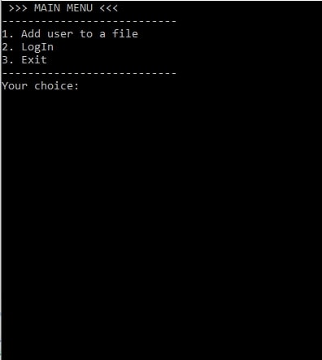
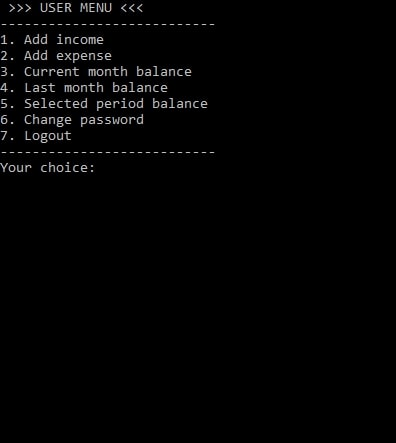
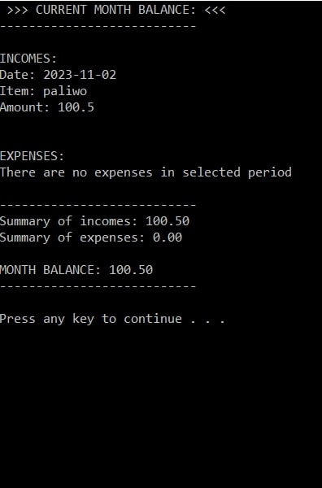
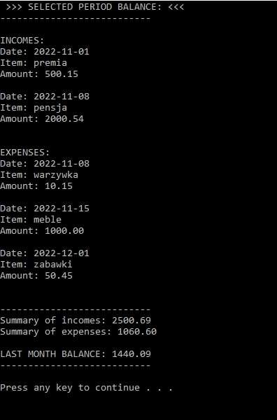

# Adress_Book_OOP

It's a program created to train the OOP C++

Features:

- registration and login
- adding incomes and expenses
- displaying all selected dates balance
- changing password of user

